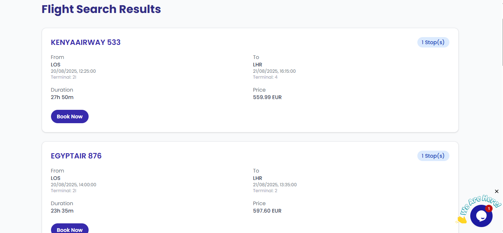

  

✈️ Flynow – Flight Search App

Flynow is a modern flight search application that helps users find flights quickly and easily.
It’s built with React (frontend) and powered by a Node.js/Express backend server that connects to a flight search API.

🚀 Features

🔎 Flight Search – Search for flights by origin, destination, and date.

🖥 Responsive UI – Built with React + Tailwind CSS for a modern look and feel.

🌍 Live Deployment – Hosted on GitHub Pages (frontend) and backend API server.

⚡ Fast & Lightweight – Optimized with React hooks, components, and API fetching.

🛠 Backend Server – Securely fetches real-time flight data from a third-party API.

🏗 Tech Stack

Frontend:

React (Vite)

Tailwind CSS

React Router

GitHub Pages for deployment

Backend:

Node.js

Express.js

API Integration with Flight Data Provider

📂 Project Structure
flynow-app/
├── frontend/        # React app (Vite setup)
│   ├── src/
│   ├── public/
│   └── package.json
├── backend/         # Node.js + Express server
│   ├── server.js
│   └── package.json
└── README.md

⚙️ Installation & Setup
Clone the repository
git clone https://github.com/your-username/flynow-app.git
cd flynow-app

Frontend Setup
cd frontend
npm install
npm run dev    # Start frontend locally

Backend Setup
cd backend
npm install
node server.js   # Start backend server

🌐 Deployment

Frontend: Hosted on GitHub Pages → https://your-username.github.io/flynow-app/

Backend: Hosted on (Render/Heroku/Vercel/Your server) → https://flynow-backend.onrender.com

📜 Manifest & PWA Support

Custom manifest.json for branding

Favicon + app icons for web and mobile

Configured for installable PWA

🧑‍💻 Author

Built with ❤️ by Daniel Udeh
Frontend Developer | Passionate about React & Real-world Apps
[Portfolio](https://diddy0077.github.io/daniel-udeh/index.html)

[LinkedIn](https://www.linkedin.com/in/daniel-udeh-a03971350/)

## 📸 Screenshots

### Homepage

### Search Results

## 🤝 Contributing
Contributions, issues, and feature requests are welcome!  
Feel free to check the [issues page](https://github.com/diddy0077/flynow-app/issues).

## 🛣 Roadmap
- [ ] Add user authentication
- [ ] Save favorite flights
- [ ] Support multi-city flights
- [ ] Dark mode UI

📜 License

This project is licensed under the MIT License.